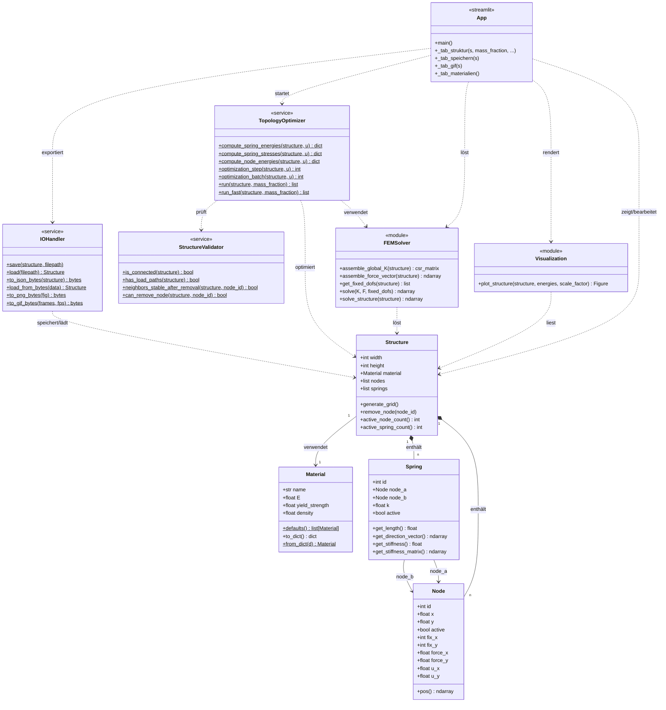
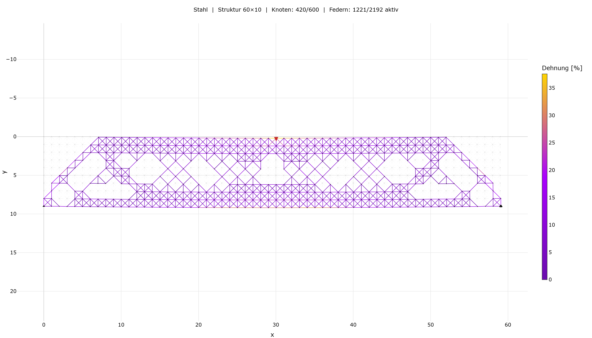

# 2D Topologie-Optimierung

Interaktive Web-App zur 2D-Topologieoptimierung mechanischer Strukturen — gebaut mit Python und Streamlit.

Uni-Abschlussprojekt, MCI Innsbruck, Softwaredesign ILV, WS 2025/26.

**Live-Demo:** [topology-optimization.streamlit.app](https://topology-optimization.streamlit.app/)

---

## Installation & Start

```bash
python -m venv .venv


.venv\Scripts\activate


pip install -r requirements.txt
streamlit run view/app.py
```

## Tests

```bash
python -m pytest tests/
```

---

## UML-Klassendiagramm



---

## Projektstruktur

```
topology-optimization/
├── model/
│   ├── node.py              # Knoten: Position, Lager, Kräfte
│   ├── spring.py            # Feder: Steifigkeit, lokale Steifigkeitsmatrix
│   ├── structure.py         # Struktur: Gitter aus Knoten + Federn
│   ├── material.py          # Materialdatenbank (Stahl, Alu, Titan, …)
│   └── graph.py             # NetworkX-Wrapper für Zusammenhangsprüfungen
├── solver/
│   ├── fem_solver.py        # K·u = F assemblieren und lösen
│   └── matrix_utils.py      # Transformationsmatrizen, Richtungsvektoren
├── optimizer/
│   ├── topology_optimizer.py  # Kern-Algorithmus, Batch-Steuerung, Symmetrie
│   └── validators.py          # Zusammenhang-, Lastpfad- und Stabilitätsprüfung
├── view/
│   ├── app.py               # Streamlit-App, Session-State, Tabs
│   ├── sidebar.py           # Eingabe: Gitter, Kräfte, Lager, Material
│   └── visualization.py     # Plotly-Plot: Struktur, Verformung, Heatmap
├── persistence/
│   └── io_handler.py        # JSON speichern/laden, PNG/GIF exportieren
└── tests/
    ├── test_solver.py
    ├── test_optimizer.py
    └── test_mbb_beam.py
```

---

## Minimalanforderungen

### Struktur definieren

Der Bauraum wird als rechteckiges Gitter mit frei wählbarer Breite und Höhe definiert. An jedem Knoten können Randbedingungen gesetzt werden: Festlager (fix x+y), Loslager (fix x oder y) sowie externe Kräfte in x- und y-Richtung. Die Eingabe erfolgt direkt im UI über die Sidebar oder per Klick auf den Plot. Ein Standard-Button setzt die klassische MBB-Balken-Konfiguration (Lager unten links/rechts, Last mittig oben) als schnellen Einstieg.

### FEM-Solver

Die Struktur wird als **Feder-Massen-Gitter** modelliert — jeder Knoten hat 2 Freiheitsgrade (x und y). Aus den einzelnen Federn wird eine globale Steifigkeitsmatrix `K` assembliert, Randbedingungen werden eingebracht, und das Gleichungssystem `K·u = F` wird mit `scipy.sparse.linalg.spsolve` gelöst. Das Ergebnis sind die Verschiebungen aller Knoten, aus denen Verformung und Federspannungen berechnet werden.

Steifigkeiten: horizontal/vertikal `k = 1.0`, diagonal `k = 1/√2`.

### Optimierungsalgorithmus

Wir nutzen einen **knotenbasierten Evolutionary Structural Optimization-Ansatz** :

1. FEM lösen → Verschiebungen `u`
2. Verformungsenergie jeder Feder: `E = 0.5 · uᵀ · K · u`
3. Energie auf die Endknoten verteilen → jeder Knoten bekommt einen Energiewert
4. Die "unwichtigsten" Knoten (niedrigste Energie) in einem Batch entfernen
5. Validierung: Struktur muss zusammenhängend bleiben, alle Lasten müssen noch zu einem Lager kommen
6. Wiederholen bis Ziel-Massenanteil erreicht

Alternativ würde **SIMP** (industrieüblicher Standard) kontinuierliche Materialdichten verwenden — das ergibt glattere Ergebnisse, ist aber deutlich aufwändiger zu implementieren.

### Topologie-Validator

Vor jedem Knotenentfernen werden drei Dinge geprüft:
- **Zusammenhang**: bleibt der Graph in einem Stück? (NetworkX)
- **Lastpfade**: kann jede Kraft noch ein Lager erreichen?
- **Mechanismen**: werden Nachbarknoten instabil (nur noch parallele Federn)?

### Visualisierung

Die Struktur wird als interaktiver Plotly-Plot dargestellt — vor, während und nach der Optimierung. Die verformte Struktur wird überlagert dargestellt, um die Verschiebungen unter Last sichtbar zu machen. Die optimierte Geometrie kann als PNG heruntergeladen werden.

### Speichern & Laden

Der vollständige Strukturzustand (Gitter, Material, Randbedingungen, Optimierungsstand) wird als JSON gespeichert und kann jederzeit wieder geladen werden — die Optimierung kann damit nahtlos fortgesetzt werden.

### MBB-Balken als Testbeispiel

Der klassische Messerschmitt-Bölkow-Blohm-Balken dient als Referenztest: 60×10-Gitter, Lager unten links/rechts, Last mittig oben. Das Ergebnis — bogenförmige Druckstreben mit diagonalen Zugstreben — ist in `tests/test_mbb_beam.py` automatisiert verifiziert.



---

## Erweiterungen

### Genau vs. Schnell

Die **genaue Methode** löst nach jedem Batch erneut die FEM und validiert jeden Kandidaten vollständig. Gegen Ende der Optimierung schrumpft der Batch auf Größe 1 — d.h. pro Iteration wird ein einziger Knoten geprüft, das LGS komplett neu gelöst, und der Validator läuft durch. Bei einem 60×10-Gitter mit 50% Ziel-Masse sind das typischerweise 100–150 solcher Iterationen, was 1–2 Minuten Laufzeit bedeutet. Bei größeren Strukturen wie z.B. 100×60 kann die genaue Methode schnell über eine halbe Stunde benötigen.

Die **schnelle Methode** reduziert die Validierungstiefe und hält die Batch-Größen länger hoch. Das funktioniert gut solange die Struktur noch genug "unkritisches" Material hat — gegen Ende kann sie jedoch in einen Zustand laufen, in dem alle verbleibenden Knoten strukturell notwendig sind, aber der Solver trotzdem keine stabile FEM-Lösung mehr liefert. In diesem Fall bricht die Optimierung ab, ohne den Ziel-Massenanteil erreicht zu haben. Das passiert vor allem bei kleinen Ziel-Massen (<40%) oder unregelmäßigen Lastfällen.

### Adaptive Batch-Größen

Die Batch-Größe wird dynamisch an den Optimierungsfortschritt angepasst. Zu Beginn (>80% Masse übrig) werden bis zu 30 Knoten pro Schritt entfernt. Ab 50% Restmasse sinkt die Batch-Größe schrittweise auf 1 — jede weitere Entfernung wird dann einzeln geprüft und bei Validierungsfehler zurückgerollt.

### Symmetrie

Der **Symmetrie-Modus** koppelt jeden Knoten mit seinem horizontalen Spiegelpendant: beide werden gemeinsam entfernt oder gar nicht. Das halbiert die effektive Suchtiefe des Optimierers und reduziert die Laufzeit der genauen Methode signifikant. Bei symmetrischen Lastfällen entspricht das außerdem dem physikalisch erwartbaren Ergebnis.

### Snapshot / Rollback

Liefert der FEM-Solver nach einem Batch keine gültige Lösung — oder verwirft der Validator den resultierenden Zustand — wird die Struktur auf den letzten stabilen Snapshot zurückgesetzt. Der Optimierer versucht dann mit Batch-Größe 1 weiter, Knoten einzeln zu entfernen. Gelingt auch das nicht dreimal in Folge, bricht die Optimierung kontrolliert ab. Das stellt sicher, dass das Ergebnis immer mechanisch konsistent ist und nie in einem unlösbaren Zustand endet.

### Dehnungs-Heatmap

Jede Feder wird farbkodiert nach ihrer aktuellen Dehnung dargestellt — von blau (gering) bis gelb (hoch). Das macht das Optimierungskriterium direkt sichtbar: Federn mit hoher Dehnung tragen viel zur Steifigkeit bei und werden vom Algorithmus bevorzugt behalten.

### Spannungsbegrenzung

Optional kann ein Spannungsgrenzwert gesetzt werden. Überschreitet die maximale Federspannung während der Optimierung diesen Wert, bricht der Algorithmus frühzeitig ab — unabhängig davon ob der Ziel-Massenanteil bereits erreicht wurde. Das entspricht der Berücksichtigung von Fertigungsbeschränkungen laut Aufgabenstellung.

### GIF-Export

Der gesamte Optimierungsverlauf kann als animiertes GIF exportiert werden — jede Iteration wird als einzelner Frame gespeichert. Das erlaubt eine nachträgliche Analyse wie die Struktur sich Schritt für Schritt entwickelt hat.

### Ergebnisbericht

Nach einer FEM-Lösung oder abgeschlossenen Optimierung wird ein ausklappbarer Ergebnisbericht angezeigt mit vier Kennwerten:

- **Massenreduktion**: Anteil der entfernten Knoten relativ zur Ausgangsstruktur in Prozent — zeigt wie viel Material tatsächlich eingespart wurde.
- **Max. Verschiebung**: Größte euklidische Verschiebung `√(ux² + uy²)` über alle aktiven Knoten — ein direktes Maß für die Verformung der Struktur unter Last.
- **Compliance (u·u)**: Skalarprodukt des Verschiebungsvektors mit sich selbst — ein globales Maß für die Nachgiebigkeit der Struktur. Niedrige Compliance bedeutet hohe Steifigkeit; dieser Wert ist das eigentliche Optimierungsziel.
- **Max. Dehnung**: Maximale Federdehnung über alle aktiven Federn — gibt an wie stark die am stärksten belastete Feder verformt wird, relevant für Materialversagen.

### Materialdatenbank

Stahl, Aluminium und Holz sind vordefiniert. Das E-Modul des gewählten Materials skaliert die Federsteifigkeiten linear — das Optimierungsergebnis bleibt topologisch identisch, die absoluten Verschiebungswerte ändern sich. Eigene Materialien lassen sich direkt in der App anlegen.

---

## Deployment

Die App ist via **Streamlit Community Cloud** deployed und öffentlich erreichbar:

[topology-optimization.streamlit.app](https://topology-optimization.streamlit.app/)

---

## Einsatz von KI

Dieses Projekt wurde mit Unterstützung von Claude Code entwickelt. KI kam dabei vor allem bei Aufgaben zum Einsatz, bei denen es nicht primär um das neue Schreiben von Code ging, sondern um Debugging, Troubleshooting und das Verfeinern bestehender Implementierungen:

- Fehlersuche und Debugging im FEM-Solver, Validator und Optimierer
- Troubleshooting bei numerischen Problemen (singuläre Matrizen, instabile Lösungen)
- Verschönern und Aufräumen von bestehendem Code (Refactoring, Docstrings)
- Unterstützung beim Streamlit-UI
- Schreiben der Unit-Tests (`tests/`)
- Schreiben des Berichtes

Verwendet wurde Claude Code (Anthropic) über die offizielle VS Code Extension. Dadurch waren alle vorgeschlagenen Änderungen direkt im Editor sichtbar — man konnte genau nachvollziehen, was geändert wurde, und jeden Vorschlag vor der Übernahme prüfen und gegenchecken.

Die fachlichen Grundlagen (FEM, ESO, Validierungslogik) kommen aus dem Studium — KI hat geholfen, diese sauberer umzusetzen und Probleme schneller zu lösen.

---

## Tech-Stack

**Python 3.11** · **Streamlit** · **NumPy/SciPy** · **NetworkX** · **Plotly** · **pytest**
